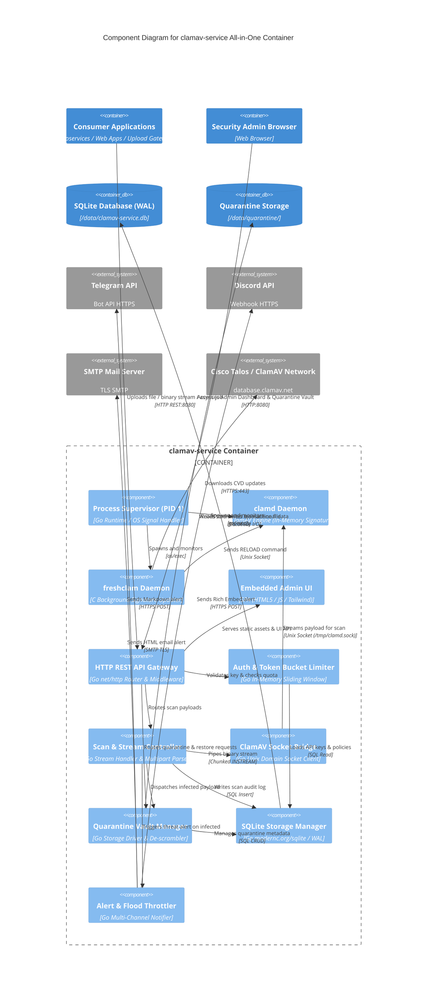

# C4 Component Diagrams — `clamav-service`

## 1. All-in-One Container Component Diagram

### Deskripsi
Diagram komponen tingkat container untuk `clamav-service` yang dieksekusi di dalam satu Docker Container mandiri berbasis Alpine Linux. Diagram ini menggambarkan hubungan antar komponen internal Go backend, antarmuka Web UI, penyimpanan SQLite & Vault karantina, komunikasi Unix Domain Socket ke daemon ClamAV (`clamd`), serta integrasi alert eksternal.

### Diagram

---

### Komponen Internal

| Komponen | Deskripsi | Teknologi |
|---|---|---|
| **Process Supervisor (PID 1)** | Master entrypoint container yang men-spawn, memonitor, dan me-restart daemon `clamd` & `freshclam`, serta menangani *graceful shutdown* sinyal OS (`SIGTERM`/`SIGINT`). | Go `os/exec`, `os/signal` |
| **HTTP REST API Gateway** | Router HTTP utama yang melayani endpoint pemindaian, manajemen karantina, health probe, dan menyajikan asset Embedded Web UI. | Go `net/http` / Chi Router |
| **Auth & Token Bucket Limiter** | Verifikasi API Key (salted hash) dan pembatasan laju request *in-memory* (Global RPS + Granular per-key). | Go `crypto/subtle`, Token Bucket |
| **Scan & Stream Controller** | Orkestrator alur pemindaian: menangani multipart upload, raw binary stream, parsing arsip terenkripsi password, dan async job queue. | Go Goroutines, `io.Reader/Writer` |
| **ClamAV Socket Bridge** | Client Unix Domain Socket yang menghubungkan API ke daemon `clamd` menggunakan protokol `INSTREAM` non-blocking. | Go `net.DialUnix` |
| **Quarantine Vault Manager** | Mengelola penyimpanan aman file terinfeksi (scrambling, penamaan `.quarantine`, izin `0600`), retensi TTL 7 hari, dan mekanisme pemulihan (*restore*). | Go File Driver, SHA-256 |
| **SQLite Storage Manager** | Layer persistensi database WAL mode untuk mencatat log audit pemindaian, metadata karantina, API keys, dan konfigurasi dinamis. | Go SQLite (WAL Mode), AES-256-GCM |
| **Alert & Flood Throttler** | Dispatcher notifikasi multi-channel (Telegram, Discord, Email) yang dilengkapi proteksi *Anti-Spam Throttling* (Batch Digest jika >5 malware/menit). | Go HTTP Client, SMTP Driver |
| **Embedded Admin UI** | Antarmuka web mandiri (SPA) untuk monitoring status daemon, drag-and-drop test scan, inspeksi karantina, dan export audit log. | HTML5, Vanilla JS, Tailwind CSS |

---

### External Systems & Subprocesses

| System / Subprocess | Tipe | Fungsi |
|---|---|---|
| **`clamd` Daemon** | Local Daemon Process | Engine antivirus inti ClamAV yang memuat ~8.5 juta signature ke RAM dan melayani pemindaian via socket `/tmp/clamd.sock`. |
| **`freshclam` Daemon** | Background Daemon Process | Proses terjadwal yang otomatis mengunduh database virus baru dari `database.clamav.net` setiap 2–4 jam. |
| **Telegram API** | External HTTPS Service | Endpoint Bot API untuk mengirimkan notifikasi instan ancaman malware ke grup/channel Telegram SecOps. |
| **Discord Webhook** | External HTTPS Service | Endpoint Webhook Discord untuk mengirimkan notifikasi Rich Embed ke channel monitoring. |
| **SMTP Mail Server** | External Mail Relay | Server surat untuk mengirimkan laporan email keamanan resmi ke daftar penerima administrator. |
| **Cisco Talos Network** | External Update Server | Server repositori resmi database signature virus ClamAV (`main.cvd`, `daily.cvd`, `bytecode.cvd`). |

---

### Relasi Utama

**Internal Flows:**
- `apiGateway` $\rightarrow$ `scanController`: Meneruskan request pemindaian file atau stream biner.
- `scanController` $\rightarrow$ `clamdBridge`: Meneruskan chunk data biner via protokol `INSTREAM`.
- `clamdBridge` $\rightarrow$ `clamdDaemon`: Mengirim payload ke Unix Socket `/tmp/clamd.sock` dan menerima verdict (`OK` / `FOUND`).
- `scanController` $\rightarrow$ `quarantineManager`: Memindahkan file terinfeksi ke Vault jika verdict `INFECTED`.
- `scanController` $\rightarrow$ `alertDispatcher`: Memicu pengiriman alert multi-channel saat malware terdeteksi.
- `quarantineManager` $\rightarrow$ `sqliteManager`: Mencatat status `QUARANTINED` / `RESTORED` dan hash whitelist.

**External Integrations:**
- `consumerApp` $\rightarrow$ `apiGateway`: Mengirimkan request pemindaian via REST API (Port 8080).
- `freshclamDaemon` $\rightarrow$ `clamavCvdNet`: Mengunduh delta update signature virus secara berkala.
- `alertDispatcher` $\rightarrow$ `telegramApi` / `discordWebhook` / `smtpServer`: Mengirimkan notifikasi alert keamanan.
