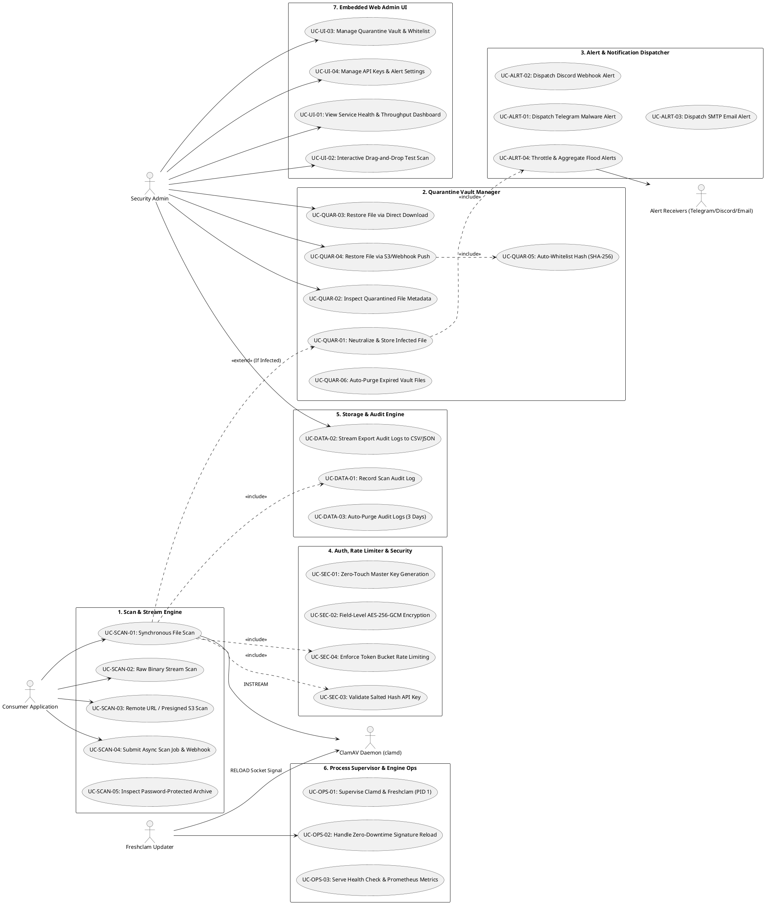

# Dokumentasi Komponen dan Use Case

## 1. Ringkasan
Dokumen ini mengelompokkan komponen fungsional yang membentuk sistem `clamav-service` berdasarkan blueprint arsitektur greenfield dan menjabarkan use case operasional yang menjadi tanggung jawab masing-masing komponen. Fokus dokumen ini adalah pemetaan batas fungsional (*functional boundary*), interaksi antar komponen internal, dan kontrak use case yang akan diuji melalui pendekatan TDD (*Test-Driven Development*).

Status dalam dokumen ini:
- `PLANNED` (MVP): Use case telah disepakati dan terdaftar dalam roadmap implementasi MVP.
- `Active`: Komponen telah diimplementasikan dan diverifikasi lulus pengujian test suite.

---

## 2. Diagram Use Case Tergrup

---

## 3. Daftar Use Case per Komponen

### 3.1. Scan & Stream Engine (`internal/scanner`, `internal/clamd`)
**Status:** ⏳ **PLANNED (MVP)**  
**Reference:** [`L-001`](file:///home/ubuntu/workspace/plan/clamav-service/.ai-doc/lampiran/L-001-Standard-JSON-Contracts-and-Error-Codes.md), [`L-005`](file:///home/ubuntu/workspace/plan/clamav-service/.ai-doc/lampiran/L-005-Edge-Cases-and-Archive-Inspection.md)

Deskripsi:
Komponen pemindai inti yang menghubungkan API gateway ke daemon ClamAV via Unix Domain Socket. Bertanggung jawab mem-parsing multipart file, mengalirkan raw binary stream, mengunduh URL remote, dan menangani arsip terenkripsi password.

Use case yang terverifikasi:
- ⏳ `UC-SCAN-01: Synchronous File Scan` (**PLANNED**)
- ⏳ `UC-SCAN-02: Raw Binary Stream Scan` (**PLANNED**)
- ⏳ `UC-SCAN-03: Remote URL / Presigned S3 Scan` (**PLANNED**)
- ⏳ `UC-SCAN-04: Submit Async Scan Job & Webhook` (**PLANNED**)
- ⏳ `UC-SCAN-05: Inspect Password-Protected Archive` (**PLANNED**)

Target Implementasi:
- `internal/scanner/scanner.go`
- `internal/clamd/client.go`
- `internal/scanner/archive.go`

Implementasi:
- Menggunakan perintah protokol socket ClamAV `zINSTREAM\0` untuk pemindaian non-blocking.
- Parsing zip-bomb limits: batas kedalaman rekursi 5 level, batas file 1.000, batas ekstraksi 250 MB.
- Kamus password umum otomatis untuk file arsip ber-password sebelum memberikan verdict `UNSCANNABLE`.

---

### 3.2. Quarantine Vault Manager (`internal/quarantine`)
**Status:** ⏳ **PLANNED (MVP)**  
**Reference:** [`L-002`](file:///home/ubuntu/workspace/plan/clamav-service/.ai-doc/lampiran/L-002-Quarantine-Vault-and-Restore-Mechanism.md)

Deskripsi:
Mengelola ruang isolasi aman untuk file terinfeksi malware pada volume lokal `/data/quarantine/`. Bertanggung jawab atas netralisasi file, retensi pembersihan otomatis (7 hari), dan dua mode pemulihan (*restore*) dengan proteksi anti re-quarantine loop.

Use case yang terverifikasi:
- ⏳ `UC-QUAR-01: Neutralize & Store Infected File` (**PLANNED**)
- ⏳ `UC-QUAR-02: Inspect Quarantined File Metadata` (**PLANNED**)
- ⏳ `UC-QUAR-03: Restore File via Direct Download` (**PLANNED**)
- ⏳ `UC-QUAR-04: Restore File via S3/Webhook Push` (**PLANNED**)
- ⏳ `UC-QUAR-05: Auto-Whitelist Hash (SHA-256)` (**PLANNED**)
- ⏳ `UC-QUAR-06: Auto-Purge Expired Vault Files (7 Days)` (**PLANNED**)

Target Implementasi:
- `internal/quarantine/vault.go`
- `internal/quarantine/restore.go`
- `internal/quarantine/cleaner.go`

Implementasi:
- Netralisasi penamaan file: `Q-YYYYMMDD-ULID.quarantine` dengan izin file `0600` dan XOR-scrambling.
- Auto-whitelist: Menyimpan SHA-256 hash file ke database saat aksi restore disetujui.

---

### 3.3. Alert & Notification Dispatcher (`internal/alert`)
**Status:** ⏳ **PLANNED (MVP)**  
**Reference:** [`L-004`](file:///home/ubuntu/workspace/plan/clamav-service/.ai-doc/lampiran/L-004-Notification-and-Alerting-Channels.md)

Deskripsi:
Subsistem notifikasi yang mengirimkan peringatan seketika saat malware terdeteksi ke Telegram Bot, Discord Webhook, dan Email SMTP, dilengkapi algoritma anti-spam flood throttling.

Use case yang terverifikasi:
- ⏳ `UC-ALRT-01: Dispatch Telegram Malware Alert` (**PLANNED**)
- ⏳ `UC-ALRT-02: Dispatch Discord Webhook Alert` (**PLANNED**)
- ⏳ `UC-ALRT-03: Dispatch SMTP Email Alert` (**PLANNED**)
- ⏳ `UC-ALRT-04: Throttle & Aggregate Flood Alerts` (**PLANNED**)

Target Implementasi:
- `internal/alert/notifier.go`
- `internal/alert/telegram.go`
- `internal/alert/discord.go`
- `internal/alert/smtp.go`

Implementasi:
- Buffer sliding window 60 detik: jika terjadi > 5 deteksi dalam 1 menit, pesan berikutnya digabungkan menjadi 1 pesan Batch Digest Summary.

---

### 3.4. Auth, Rate Limiter & Security (`internal/crypto`, `internal/ratelimit`)
**Status:** ⏳ **PLANNED (MVP)**  
**Reference:** [`L-003`](file:///home/ubuntu/workspace/plan/clamav-service/.ai-doc/lampiran/L-003-Security-Encryption-and-Key-Lifecycle.md)

Deskripsi:
Menangani keamanan kriptografi, otentikasi API Key, pembatasan laju request (Token Bucket), enkripsi database field-level, dan inisialisasi master key otomatis pada first boot.

Use case yang terverifikasi:
- ⏳ `UC-SEC-01: Zero-Touch Master Key Generation` (**PLANNED**)
- ⏳ `UC-SEC-02: Field-Level AES-256-GCM Encryption` (**PLANNED**)
- ⏳ `UC-SEC-03: Validate Salted Hash API Key` (**PLANNED**)
- ⏳ `UC-SEC-04: Enforce Token Bucket Rate Limiting` (**PLANNED**)

Target Implementasi:
- `internal/crypto/keygen.go`
- `internal/crypto/aes.go`
- `internal/ratelimit/limiter.go`
- `internal/auth/validator.go`

Implementasi:
- Auto-write `ENCRYPTION_KEY` ke `.env` saat cold start jika belum tersedia.
- Enkripsi simetris AES-256-GCM dengan nonce acak 96-bit untuk token dan password di SQLite.

---

### 3.5. Storage & Audit Engine (`internal/storage`)
**Status:** ⏳ **PLANNED (MVP)**  
**Reference:** [`project-overview.md`](file:///home/ubuntu/workspace/plan/clamav-service/.ai-doc/project-overview.md)

Deskripsi:
Layer persistensi transaksi menggunakan SQLite dalam mode WAL (Write-Ahead Logging), mencatat seluruh log audit pemindaian, mengekspor laporan ke CSV/JSON, dan membersihkan log kadaluarsa (3 hari).

Use case yang terverifikasi:
- ⏳ `UC-DATA-01: Record Scan Audit Log` (**PLANNED**)
- ⏳ `UC-DATA-02: Stream Export Audit Logs to CSV/JSON` (**PLANNED**)
- ⏳ `UC-DATA-03: Auto-Purge Audit Logs (3 Days)` (**PLANNED**)

Target Implementasi:
- `internal/storage/sqlite.go`
- `internal/storage/audit.go`
- `internal/storage/exporter.go`

Implementasi:
- Menjalankan `PRAGMA journal_mode=WAL` dan `PRAGMA synchronous=NORMAL`.
- Streaming chunked transfer untuk export CSV/JSON ribuan baris log tanpa lonjakan RAM.

---

### 3.6. Process Supervisor & Engine Ops (`internal/supervisor`)
**Status:** ⏳ **PLANNED (MVP)**  
**Reference:** [`L-006`](file:///home/ubuntu/workspace/plan/clamav-service/.ai-doc/lampiran/L-006-Container-Architecture-and-Process-Supervision.md)

Deskripsi:
Master entrypoint (PID 1) yang mengelola siklus hidup proses `clamd` dan `freshclam`, menangani penutupan bersih sinyal OS (`SIGTERM`/`SIGINT`), dan menyajikan endpoint monitoring kesehatan.

Use case yang terverifikasi:
- ⏳ `UC-OPS-01: Supervise Clamd & Freshclam (PID 1)` (**PLANNED**)
- ⏳ `UC-OPS-02: Handle Zero-Downtime Signature Reload` (**PLANNED**)
- ⏳ `UC-OPS-03: Serve Health Check & Prometheus Metrics` (**PLANNED**)

Target Implementasi:
- `internal/supervisor/supervisor.go`
- `internal/supervisor/health.go`
- `internal/supervisor/metrics.go`

Implementasi:
- Polling Unix Socket readiness saat booting sebelum HTTP API dibuka.
- Graceful shutdown dengan grace period 15 detik untuk menyelesaikan scan aktif.

---

### 3.7. Embedded Web Admin UI (`web/`, `internal/api`)
**Status:** ⏳ **PLANNED (MVP)**  
**Reference:** [`project-overview.md`](file:///home/ubuntu/workspace/plan/clamav-service/.ai-doc/project-overview.md)

Deskripsi:
Antarmuka web SPA mandiri yang di-embed langsung ke dalam binary Go, menyediakan visualisasi status daemon, drag-and-drop file scanner, manajemen file karantina, dan pembuatan API Key.

Use case yang terverifikasi:
- ⏳ `UC-UI-01: View Service Health & Throughput Dashboard` (**PLANNED**)
- ⏳ `UC-UI-02: Interactive Drag-and-Drop Test Scan` (**PLANNED**)
- ⏳ `UC-UI-03: Manage Quarantine Vault & Whitelist` (**PLANNED**)
- ⏳ `UC-UI-04: Manage API Keys & Alert Settings` (**PLANNED**)

Target Implementasi:
- `web/static/` (HTML, JS, CSS)
- `internal/api/router.go`
- `internal/api/ui_handler.go`

---

## 4. Catatan Pengelompokan & Sinkronisasi DCD

### Synchronization Status
- ⏳ **Pending DCD Creation**: Komponen-komponen di atas telah dipetakan secara rapi dan siap diturunkan ke artefak `DCD-*` (*Design Component Document*) apabila diminta secara spesifik.

### Key Separation Notes
- **`Scan & Stream Engine` vs `Quarantine Vault Manager`:** Dipisahkan secara tegas agar logika pemindaian in-memory ClamAV tidak terikat langsung pada filesystem storage karantina.
- **`Process Supervisor` vs `HTTP API Gateway`:** Supervisor bertanggung jawab atas level OS dan subprocess (`clamd`/`freshclam`), sedangkan API Gateway fokus murni pada routing HTTP dan validasi protokol.
