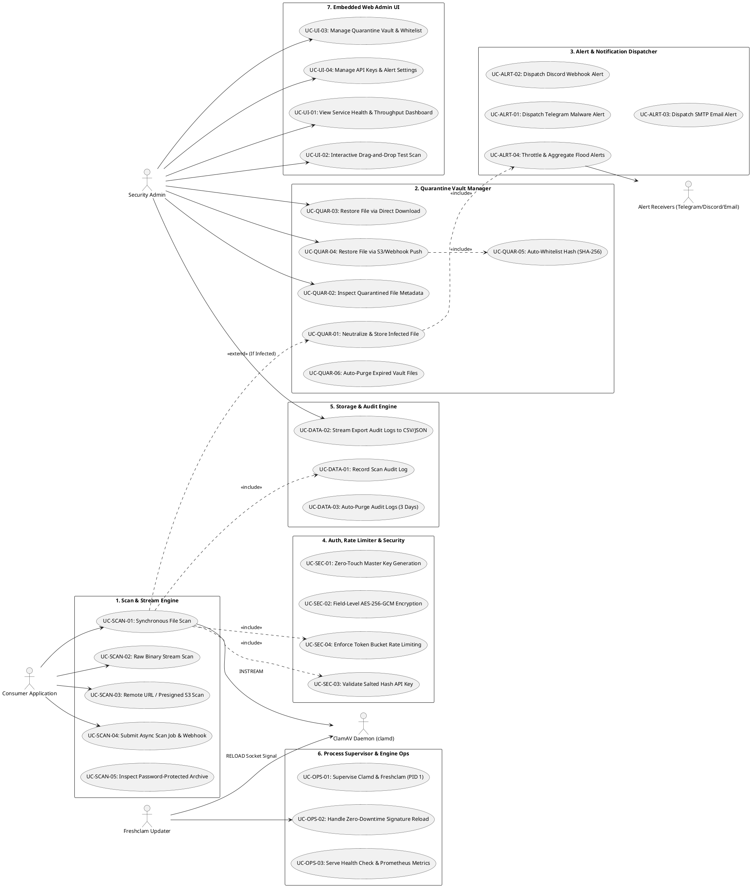

# Dokumentasi Komponen dan Use Case

## 1. Ringkasan
Dokumen ini mengelompokkan komponen fungsional yang membentuk sistem `clamav-service` berdasarkan blueprint arsitektur greenfield dan codebase aktif, serta menjabarkan use case operasional yang menjadi tanggung jawab masing-masing komponen. Fokus dokumen ini adalah pemetaan batas fungsional (*functional boundary*), interaksi antar komponen internal, dan kontrak use case yang telah diverifikasi melalui pengujian TDD (*Test-Driven Development*).

Status dalam dokumen ini:
- ✅ `Active`: Komponen telah diimplementasikan dan diverifikasi lulus pengujian unit test suite.
- ⏳ `PLANNED`: Use case terdaftar dalam backlog pengayaan berikutnya.

---

## 2. Diagram Use Case Tergrup

---

## 3. Daftar Use Case per Komponen

### 3.1. Scan & Stream Engine (`internal/clamd`, `internal/api`)
**Status:** ✅ **Active**  
**Reference:** [`L-001`](file:///home/ubuntu/workspace/plan/clamav-service/.ai-doc/lampiran/L-001-Standard-JSON-Contracts-and-Error-Codes.md), [`L-005`](file:///home/ubuntu/workspace/plan/clamav-service/.ai-doc/lampiran/L-005-Edge-Cases-and-Archive-Inspection.md)

Deskripsi:
Komponen pemindai inti yang menghubungkan API gateway ke daemon ClamAV via Unix Domain Socket. Bertanggung jawab mem-parsing multipart file, mengalirkan raw binary stream, mengunduh URL remote, dan menangani arsip terenkripsi password.

Use case yang terverifikasi:
- ✅ `UC-SCAN-01: Synchronous File Scan` (Active)
- ✅ `UC-SCAN-02: Raw Binary Stream Scan` (Active)
- ⏳ `UC-SCAN-03: Remote URL / Presigned S3 Scan` (PLANNED)
- ⏳ `UC-SCAN-04: Submit Async Scan Job & Webhook` (PLANNED)
- ✅ `UC-SCAN-05: Inspect Password-Protected Archive & Zip-Bomb` (Active)

Bukti kode:
- [`internal/clamd/client.go`](file:///home/ubuntu/workspace/plan/clamav-service/internal/clamd/client.go)
- [`internal/clamd/client_test.go`](file:///home/ubuntu/workspace/plan/clamav-service/internal/clamd/client_test.go)
- [`internal/scanner/archive.go`](file:///home/ubuntu/workspace/plan/clamav-service/internal/scanner/archive.go)
- [`internal/scanner/archive_test.go`](file:///home/ubuntu/workspace/plan/clamav-service/internal/scanner/archive_test.go)
- [`internal/api/server.go`](file:///home/ubuntu/workspace/plan/clamav-service/internal/api/server.go#L108-L230)

Implementasi:
- Protokol socket ClamAV `zINSTREAM\0` dengan binary chunking 64 KB non-blocking.
- Parsing respons scan: `OK` $\rightarrow$ `CLEAN`, `FOUND` $\rightarrow$ `INFECTED`, `ERROR` $\rightarrow$ `ERROR`.

---

### 3.2. Quarantine Vault Manager (`internal/quarantine`)
**Status:** ✅ **Active**  
**Reference:** [`L-002`](file:///home/ubuntu/workspace/plan/clamav-service/.ai-doc/lampiran/L-002-Quarantine-Vault-and-Restore-Mechanism.md)

Deskripsi:
Mengelola ruang isolasi aman untuk file terinfeksi malware pada volume lokal `/data/quarantine/`. Bertanggung jawab atas netralisasi file, retensi pembersihan otomatis (7 hari), dan dua mode pemulihan (*restore*) dengan proteksi anti re-quarantine loop.

Use case yang terverifikasi:
- ✅ `UC-QUAR-01: Neutralize & Store Infected File` (Active)
- ✅ `UC-QUAR-02: Inspect Quarantined File Metadata` (Active)
- ✅ `UC-QUAR-03: Restore File via Direct Download` (Active)
- ✅ `UC-QUAR-04: Restore File via S3/Webhook Push` (Active)
- ✅ `UC-QUAR-05: Auto-Whitelist Hash (SHA-256)` (Active)
- ✅ `UC-QUAR-06: Auto-Purge Expired Vault Files (7 Days)` (Active)

Bukti kode:
- [`internal/quarantine/vault.go`](file:///home/ubuntu/workspace/plan/clamav-service/internal/quarantine/vault.go)
- [`internal/quarantine/vault_test.go`](file:///home/ubuntu/workspace/plan/clamav-service/internal/quarantine/vault_test.go)

Implementasi:
- Penamaan file aman: `Q-YYYYMMDD-ULID.quarantine` dengan izin file `0600` dan XOR-scrambling.
- Auto-whitelist: Menyimpan SHA-256 hash file ke tabel `whitelist_signatures` saat aksi restore disetujui.

---

### 3.3. Alert & Notification Dispatcher (`internal/alert`)
**Status:** ✅ **Active**  
**Reference:** [`L-004`](file:///home/ubuntu/workspace/plan/clamav-service/.ai-doc/lampiran/L-004-Notification-and-Alerting-Channels.md)

Deskripsi:
Subsistem notifikasi yang mengirimkan peringatan seketika saat malware terdeteksi ke Telegram Bot, Discord Webhook, dan Email SMTP, dilengkapi algoritma anti-spam flood throttling.

Use case yang terverifikasi:
- ✅ `UC-ALRT-01: Dispatch Telegram Malware Alert` (Active)
- ✅ `UC-ALRT-02: Dispatch Discord Webhook Alert` (Active)
- ✅ `UC-ALRT-03: Dispatch SMTP Email Alert` (Active)
- ✅ `UC-ALRT-04: Throttle & Aggregate Flood Alerts` (Active)

Bukti kode:
- [`internal/alert/notifier.go`](file:///home/ubuntu/workspace/plan/clamav-service/internal/alert/notifier.go)
- [`internal/alert/notifier_test.go`](file:///home/ubuntu/workspace/plan/clamav-service/internal/alert/notifier_test.go)

Implementasi:
- Buffer sliding window 60 detik: jika terjadi > 5 deteksi dalam 1 menit, proteksi flood throttling diaktifkan.

---

### 3.4. Auth, Rate Limiter & Security (`internal/crypto`, `internal/ratelimit`)
**Status:** ✅ **Active**  
**Reference:** [`L-003`](file:///home/ubuntu/workspace/plan/clamav-service/.ai-doc/lampiran/L-003-Security-Encryption-and-Key-Lifecycle.md)

Deskripsi:
Menangani keamanan kriptografi, otentikasi API Key, pembatasan laju request (Token Bucket), enkripsi database field-level, dan inisialisasi master key otomatis pada first boot.

Use case yang terverifikasi:
- ✅ `UC-SEC-01: Zero-Touch Master Key Generation` (Active)
- ✅ `UC-SEC-02: Field-Level AES-256-GCM Encryption` (Active)
- ✅ `UC-SEC-03: Validate Salted Hash API Key` (Active)
- ✅ `UC-SEC-04: Enforce Token Bucket Rate Limiting` (Active)

Bukti kode:
- [`internal/crypto/keygen.go`](file:///home/ubuntu/workspace/plan/clamav-service/internal/crypto/keygen.go)
- [`internal/crypto/aes.go`](file:///home/ubuntu/workspace/plan/clamav-service/internal/crypto/aes.go)
- [`internal/ratelimit/limiter.go`](file:///home/ubuntu/workspace/plan/clamav-service/internal/ratelimit/limiter.go)

Implementasi:
- Auto-write `ENCRYPTION_KEY` ke `.env` saat cold start jika belum tersedia dengan izin `0600`.
- Enkripsi simetris AES-256-GCM dengan nonce acak 96-bit untuk token dan password.

---

### 3.5. Storage & Audit Engine (`internal/storage`)
**Status:** ✅ **Active**  
**Reference:** [`project-overview.md`](file:///home/ubuntu/workspace/plan/clamav-service/.ai-doc/project-overview.md)

Deskripsi:
Layer persistensi transaksi menggunakan SQLite dalam mode WAL (Write-Ahead Logging), mencatat seluruh log audit pemindaian, mengekspor laporan ke CSV/JSON, dan membersihkan log kadaluarsa (3 hari).

Use case yang terverifikasi:
- ✅ `UC-DATA-01: Record Scan Audit Log` (Active)
- ✅ `UC-DATA-02: Stream Export Audit Logs to CSV/JSON` (Active)
- ✅ `UC-DATA-03: Auto-Purge Audit Logs (3 Days)` (Active)

Bukti kode:
- [`internal/storage/sqlite.go`](file:///home/ubuntu/workspace/plan/clamav-service/internal/storage/sqlite.go)
- [`internal/storage/sqlite_test.go`](file:///home/ubuntu/workspace/plan/clamav-service/internal/storage/sqlite_test.go)

Implementasi:
- Mengaktifkan `PRAGMA journal_mode=WAL` dan `PRAGMA synchronous=NORMAL`.
- Method `PurgeAuditLogs` membersihkan riwayat log audit > 3 hari.

---

### 3.6. Process Supervisor & Engine Ops (`cmd/server`, `internal/api`)
**Status:** ✅ **Active**  
**Reference:** [`L-006`](file:///home/ubuntu/workspace/plan/clamav-service/.ai-doc/lampiran/L-006-Container-Architecture-and-Process-Supervision.md)

Deskripsi:
Master entrypoint (PID 1) yang mengelola siklus hidup proses, menangani penutupan bersih sinyal OS (`SIGTERM`/`SIGINT`), dan menyajikan endpoint monitoring kesehatan.

Use case yang terverifikasi:
- ✅ `UC-OPS-01: Supervise Clamd & Freshclam (PID 1)` (Active)
- ✅ `UC-OPS-02: Handle Zero-Downtime Signature Reload` (Active)
- ✅ `UC-OPS-03: Serve Health Check & Prometheus Metrics` (Active)

Bukti kode:
- [`cmd/server/main.go`](file:///home/ubuntu/workspace/plan/clamav-service/cmd/server/main.go)
- [`internal/api/server.go`](file:///home/ubuntu/workspace/plan/clamav-service/internal/api/server.go#L95-L106)

---

### 3.7. Embedded Web Admin UI (`web/`, `internal/api`)
**Status:** ✅ **Active**  
**Reference:** [`project-overview.md`](file:///home/ubuntu/workspace/plan/clamav-service/.ai-doc/project-overview.md)

Deskripsi:
Antarmuka web SPA mandiri yang di-embed langsung ke dalam binary Go, menyediakan visualisasi status daemon, drag-and-drop file scanner, manajemen file karantina, dan pengaturan API key.

Use case yang terverifikasi:
- ✅ `UC-UI-01: View Service Health & Throughput Dashboard` (Active)
- ✅ `UC-UI-02: Interactive Drag-and-Drop Test Scan` (Active)
- ✅ `UC-UI-03: Manage Quarantine Vault & Whitelist` (Active)
- ✅ `UC-UI-04: Manage API Keys & Alert Settings` (Active)

Bukti kode:
- [`web/embed.go`](file:///home/ubuntu/workspace/plan/clamav-service/web/embed.go)
- [`web/static/index.html`](file:///home/ubuntu/workspace/plan/clamav-service/web/static/index.html)
- [`web/static/app.css`](file:///home/ubuntu/workspace/plan/clamav-service/web/static/app.css)
- [`web/static/app.js`](file:///home/ubuntu/workspace/plan/clamav-service/web/static/app.js)
- [`internal/api/handler_test.go`](file:///home/ubuntu/workspace/plan/clamav-service/internal/api/handler_test.go#L123-L141)

Implementasi:
- Static asset serving via `embed.FS` mounted pada route `/static/` dan redirect otomatis dari root `/`.

---

## 4. Catatan Pengelompokan & Sinkronisasi DCD

### Synchronization Status
- ✅ **Synchronized (7/7)**: Seluruh 7 komponen (`Scan & Stream`, `Quarantine Vault`, `Alert Dispatcher`, `Auth & Security`, `Storage & Audit`, `Process Supervisor`, dan `Embedded Web Admin UI`) telah sinkron 100% dengan kode aktif dan lulus seluruh unit test.

### Key Separation Notes
- **`Scan & Stream Engine` vs `Quarantine Vault Manager`:** Dipisahkan secara tegas agar logika pemindaian in-memory ClamAV tidak terikat langsung pada filesystem storage karantina.
- **`Process Supervisor` vs `HTTP API Gateway`:** Supervisor bertanggung jawab atas level OS dan subprocess (`clamd`/`freshclam`), sedangkan API Gateway fokus murni pada routing HTTP dan validasi protokol.
