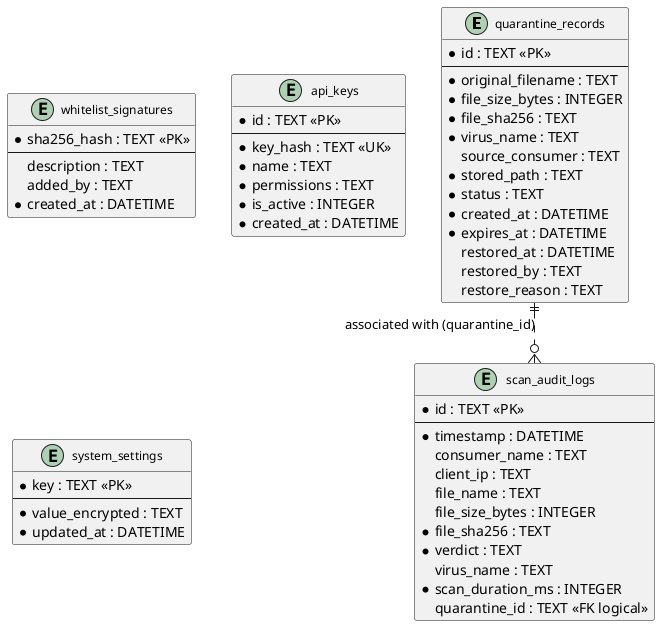

# Entity Relationship Diagram (ERD) — Overview

## 1. Ringkasan Basis Data

| Komponen | Spesifikasi |
|---|---|
| **Database Engine** | SQLite 3 (ModernC pure Go driver) |
| **Storage Path** | `/data/clamav-service.db` (dapat dikonfigurasi via env `DB_PATH`) |
| **Concurrency Mode** | WAL (*Write-Ahead Logging*) |
| **Pragma Settings** | `journal_mode(WAL)`, `synchronous(NORMAL)`, `busy_timeout(5000)`, `foreign_keys(ON)` |
| **Jumlah Tabel** | 5 Tabel (`scan_audit_logs`, `quarantine_records`, `whitelist_signatures`, `api_keys`, `system_settings`) |
| **Sumber Kode & Migrasi** | [`internal/storage/sqlite.go`](file:///home/ubuntu/workspace/plan/clamav-service/internal/storage/sqlite.go) |

---

## 2. Diagram ERD (PlantUML Information Engineering)

---

## 3. Penjelasan Relasi Antar Tabel

### 3.1. Relasi Logical: `quarantine_records` ke `scan_audit_logs`
* **Karakteristik Relasi:** One-to-Many Logical Relation (`0..1` to `0..N`).
* **Source Column:** `scan_audit_logs.quarantine_id`
* **Target Column:** `quarantine_records.id`
* **Sifat Hubungan:** **Logical Application Reference** (Tidak menggunakan constraint `FOREIGN KEY REFERENCES` fisik pada DDL SQLite demi menjaga performa penulisan audit log yang independen dan asynchronous).
* **Aturan Bisnis:** 
  - Jika verdict adalah `CLEAN`, kolom `quarantine_id` pada `scan_audit_logs` bernilai `NULL`.
  - Jika verdict adalah `INFECTED`, kolom `quarantine_id` diisi dengan ID dari berkas yang diisolasi di `quarantine_records`.

### 3.2. Tabel Mandiri (*Independent Entities*)
* **`whitelist_signatures`**: Berdiri sendiri sebagai kamus hash SHA-256 berkas yang telah diverifikasi aman oleh Security Admin.
* **`api_keys`**: Berdiri sendiri untuk memvalidasi kredensial autentikasi API consumer.
* **`system_settings`**: Tabel konfigurasi key-value persisten terenkripsi (misalnya password dashboard UI ter-hash/enkripsi).

---

## 4. Daftar Indeks Kinerja

| Nama Indeks | Tabel Target | Kolom Indeks | Alasan Kinerja |
|---|---|---|---|
| `idx_audit_timestamp` | `scan_audit_logs` | `timestamp` | Mempercepat query export audit log dan purge retensi histori berkala. |
| `idx_audit_verdict` | `scan_audit_logs` | `verdict` | Mempercepat filtering statistik dan alert dashboard (`CLEAN` vs `INFECTED`). |
| `idx_audit_sha256` | `scan_audit_logs` | `file_sha256` | Mempercepat pelacakan histori pemindaian berdasarkan hash berkas. |
| `idx_quar_status` | `quarantine_records` | `status` | Mempercepat filtering berkas di UI (`QUARANTINED`, `RESTORED`, `DELETED`). |
| `idx_quar_expires` | `quarantine_records` | `expires_at` | Mempercepat *background worker* dalam mendeteksi dan menghapus berkas kedaluwarsa. |
