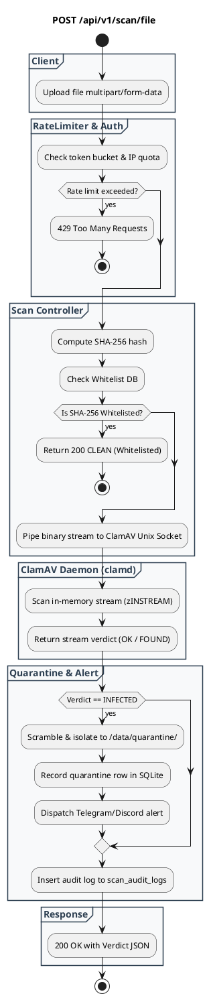

# REST API Spec — `POST /api/v1/scan/file`

## 1. Metadata

| Method | Endpoint | Description |
|---|---|---|
| `POST` | `/api/v1/scan/file` | Pemindaian malware sinkron via multipart file upload dengan instant verdict (`CLEAN` / `INFECTED`). |

---

## 2. Diagram Swimlane



---

## 3. API Spec

### 3.1 Authentication
- `Optional / Configurable`: Bearer Token (`Authorization: Bearer clam_live_...`) jika `REQUIRE_API_KEY=true`.

### 3.2 Header Parameter

| Key | Required | Type | Default | Description |
|---|---|---|---|---|
| `Content-Type` | Yes | string | `multipart/form-data` | Multipart form boundary |
| `Authorization` | No | string | - | Bearer API Key |
| `X-Consumer-Name` | No | string | `Anonymous-Client` | Nama aplikasi pengirim untuk audit log |

### 3.3 Request Body
Multipart Form Data:
- `file` (File binary, required): File yang akan dipindai (maksimal 100 MB).

### 3.4 Response

**Code**: 200 OK (Clean)  
**Meaning**: File bersih dari malware  
**Condition**: ClamAV daemon mengembalikan status OK  
**JSON**:
```json
{
  "success": true,
  "verdict": "CLEAN",
  "data": {
    "file_name": "annual_report.pdf",
    "file_size": 2048576,
    "file_sha256": "275a021bbfb6489e54d471899f7db9d1663fc695ec2fe2a2c4538aabf651fd0f",
    "scan_duration_ms": 42,
    "scanned_at": "2026-09-02T19:30:00Z"
  }
}
```

**Code**: 200 OK (Infected)  
**Meaning**: File terdeteksi mengandung malware & otomatis diisolasi  
**Condition**: ClamAV daemon mendeteksi signature virus  
**JSON**:
```json
{
  "success": true,
  "verdict": "INFECTED",
  "threat": {
    "virus_name": "Win.Trojan.Agent-1234",
    "severity": "HIGH",
    "action_taken": "QUARANTINED",
    "quarantine_id": "Q-20260902-8f92a10b"
  },
  "data": {
    "file_name": "invoice.pdf.exe",
    "file_size": 1048576,
    "file_sha256": "e3b0c44298fc1c149afbf4c8996fb92427ae41e4649b934ca495991b7852b855",
    "scan_duration_ms": 38
  }
}
```

**Code**: 429 Too Many Requests  
**Meaning**: Rate limit kuota terlampaui  
**JSON**:
```json
{
  "success": false,
  "error": {
    "code": "RATE_LIMIT_EXCEEDED",
    "message": "Rate limit exceeded. Please retry later.",
    "details": {
      "retry_after_seconds": 45
    }
  }
}
```

---

## 4. Rules & Non-Functional Requirements
- **Max File Size**: 100 MB per request (dibatasi via `http.MaxBytesReader`).
- **Timeout**: 30 detik batas waktu pemindaian stream socket.
- **Audit Logging**: Setiap request pemindaian dicatat ke tabel SQLite `scan_audit_logs`.
