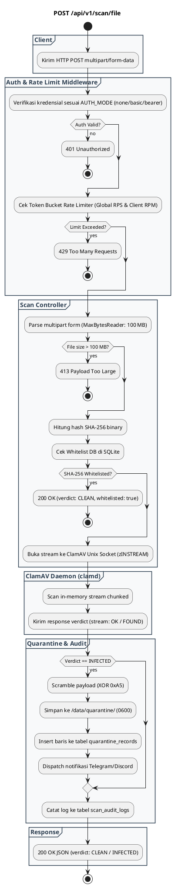

# REST API Spec — `POST /api/v1/scan/file`

## 1. Metadata

| Method | Endpoint | Description |
|---|---|---|
| `POST` | `/api/v1/scan/file` | Pemindaian malware sinkron via multipart file upload dengan instant verdict (`CLEAN` / `INFECTED`). |

---

## 2. Diagram Swimlane



---

## 3. API Spec

### 3.1 Authentication
- Model: Ditentukan oleh konfigurasi `AUTH_MODE`:
  - `none` (*Default*): Tidak memerlukan autentikasi.
  - `basic`: Mewajibkan header `Authorization: Basic <base64(user:pass)>`.
  - `bearer`: Mewajibkan header `Authorization: Bearer <token>` atau `X-API-Key: <token>`.

### 3.2 Query Parameter
- `Tidak ada`

### 3.3 Path Parameter
- `Tidak ada`

### 3.4 Header Parameter

| Key | Required | Type | Default | Description |
|---|---|---|---|---|
| `Content-Type` | Yes | string | `multipart/form-data` | Multipart boundary encoding |
| `Authorization` | Conditional | string | - | Kredensial sesuai `AUTH_MODE` (Basic / Bearer) |
| `X-API-Key` | Conditional | string | - | Alternatif bearer token jika `AUTH_MODE=bearer` |
| `X-Consumer-Name` | No | string | `Anonymous-Client` | Identitas service pemanggil untuk audit trail |

### 3.5 Request Body
Multipart Form Data:
- `file` (Binary File, Required): Berkas file yang akan dipindai (maksimal 100 MB).

### 3.6 Response

**Code**: 200 OK (Clean)  
**Meaning**: File bersih dari ancaman malware  
**Condition**: ClamAV mengembalikan status `stream: OK` atau hash file terdaftar di whitelist  
**JSON**:
```json
{
  "success": true,
  "verdict": "CLEAN",
  "data": {
    "file_name": "document.pdf",
    "file_size": 2048576,
    "file_sha256": "85fd0bd05139936de5a2fb89ce9269ddc3980dcf64c7bc6064e1c6567d15c61a",
    "scan_duration_ms": 32,
    "scanned_at": "2026-09-03T02:53:20Z"
  }
}
```

**Code**: 200 OK (Infected)  
**Meaning**: File terdeteksi mengandung signature malware dan otomatis diisolasi  
**Condition**: ClamAV mendeteksi signature virus (`stream: <virus_name> FOUND`)  
**JSON**:
```json
{
  "success": true,
  "verdict": "INFECTED",
  "threat": {
    "virus_name": "Eicar-Test-Signature",
    "severity": "HIGH",
    "action_taken": "QUARANTINED",
    "quarantine_id": "Q-20260903-12ca0cb78c333bf4"
  },
  "data": {
    "file_name": "malware.exe",
    "file_size": 68,
    "file_sha256": "275a021bbfb6489e54d471899f7db9d1663fc695ec2fe2a2c4538aabf651fd0f",
    "scan_duration_ms": 7
  }
}
```

**Code**: 400 Bad Request  
**Meaning**: Payload multipart tidak valid atau field `file` tidak ditemukan  
**JSON**:
```json
{
  "success": false,
  "error": {
    "code": "INVALID_REQUEST_PAYLOAD",
    "message": "Missing 'file' multipart form field",
    "details": null
  }
}
```

**Code**: 401 Unauthorized  
**Meaning**: Kredensial autentikasi salah atau tidak disertakan saat `AUTH_MODE` aktif  
**JSON**:
```json
{
  "success": false,
  "error": {
    "code": "UNAUTHORIZED",
    "message": "Invalid or missing basic authentication credentials",
    "details": null
  }
}
```

**Code**: 413 Payload Too Large  
**Meaning**: Ukuran file melebihi batas konfigurasi `MAX_SCAN_SIZE_MB` (default 100 MB)  
**JSON**:
```json
{
  "success": false,
  "error": {
    "code": "FILE_TOO_LARGE",
    "message": "Uploaded file exceeds maximum limit",
    "details": null
  }
}
```

**Code**: 429 Too Many Requests  
**Meaning**: Batas rate limit token bucket terlampaui  
**JSON**:
```json
{
  "success": false,
  "error": {
    "code": "RATE_LIMIT_EXCEEDED",
    "message": "Rate limit quota exceeded. Please retry later.",
    "details": {
      "retry_after_seconds": 45
    }
  }
}
```

**Code**: 503 Service Unavailable  
**Meaning**: ClamAV daemon socket mati, crash, atau sedang loading signature  
**JSON**:
```json
{
  "success": false,
  "error": {
    "code": "ENGINE_UNAVAILABLE",
    "message": "Antivirus daemon unavailable or timed out",
    "details": null
  }
}
```

### 3.7 Notes
- Streaming langsung ke Unix Socket `zINSTREAM\0` tanpa write file sementara ke disk host.
- Setiap response menyertakan header telemetry `X-RateLimit-*`.

---

## 4. Rules

### 4.1 Authentication
- Bebas diakses jika `AUTH_MODE=none`.
- Wajib menyertakan basic auth / bearer token jika `AUTH_MODE` diatur ke `basic` / `bearer`.

### 4.2 Validation
- Field `file` pada form-data wajib ada dan tidak boleh kosong.
- Ukuran file dibatasi oleh `MAX_SCAN_SIZE_MB` via `http.MaxBytesReader`.

### 4.3 Error Handling
- Jika daemon ClamAV tidak merespons dalam 30 detik, request dibatalkan dan mengembalikan `503 ENGINE_UNAVAILABLE`.

### 4.4 Rate Limiting
- Token bucket global limit default 50 RPS (`RATE_LIMIT_GLOBAL_RPS`).
- Per-consumer limit default 100 RPM (`RATE_LIMIT_DEFAULT_RPM_PER_KEY`).

### 4.5 Idempotency
- Pemindaian file identik menghasilkan hash dan verdict deterministik yang sama.
- File yang terdeteksi `INFECTED` akan di-quarantine setiap kali di-upload kecuali hash-nya di-whitelist.

### 4.6 Security
- Payload yang terinfeksi di-scramble dengan masking XOR `0xA5` dan izin file `0600` di `/data/quarantine/`.
- File stream di-scan di RAM tanpa eksekusi langsung.

### 4.7 Non-Functional
- Target latensi pemindaian: < 50 ms untuk file tipikal (< 5 MB).
- Audit log otomatis disimpan ke SQLite (`scan_audit_logs`) dengan retensi 3 hari.

### 4.8 Dependency
- Daemon ClamAV via Unix Domain Socket (`/var/run/clamav/clamd.ctl`).
- SQLite DB (`/data/clamav-service.db`) untuk whitelist dan audit trail.
- Vault karantina (`/data/quarantine`).

### 4.9 Versioning
- Endpoint versi v1: `/api/v1/scan/file`.

---

## 5. Asumsi, Risiko, dan Hal yang Perlu Dikonfirmasi

### Asumsi
- File upload diproses dalam memori sehingga RAM container minimal dialokasikan 1.5 GB.

### Risiko Dokumentasi Tidak Lengkap
- File arsip terenkripsi (zip dengan password) akan lolos pemindaian signature jika password tidak disertakan.

### Perlu Dikonfirmasi
- Penambahan opsi custom threshold timeout pemindaian per-consumer di masa depan.
