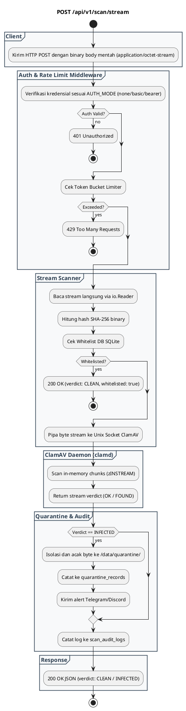

# REST API Spec — `POST /api/v1/scan/stream`

## 1. Metadata

| Method | Endpoint | Description |
|---|---|---|
| `POST` | `/api/v1/scan/stream` | Pemindaian raw binary stream chunked tanpa overhead multipart payload. |

---

## 2. Diagram Swimlane



---

## 3. API Spec

### 3.1 Authentication
- Mengikuti kebijakan `AUTH_MODE` (`none`, `basic`, `bearer`).

### 3.2 Query Parameter
- `Tidak ada`

### 3.3 Path Parameter
- `Tidak ada`

### 3.4 Header Parameter

| Key | Required | Type | Default | Description |
|---|---|---|---|---|
| `Content-Type` | Yes | string | `application/octet-stream` | Format binary stream |
| `Authorization` | Conditional | string | - | Kredensial sesuai `AUTH_MODE` |
| `X-API-Key` | Conditional | string | - | Alternatif bearer token |
| `X-Consumer-Name` | No | string | `Anonymous-Client` | Identitas service pengirim |
| `X-File-Name` | No | string | `stream_upload.bin` | Nama file metadata untuk audit log |

### 3.5 Request Body
Binary Stream (`application/octet-stream`):
- Raw binary bytes yang dikirim langsung di HTTP request body (maksimal 100 MB).

### 3.6 Response

**Code**: 200 OK (Clean)  
**Meaning**: Stream binary bersih dari malware  
**JSON**:
```json
{
  "success": true,
  "verdict": "CLEAN",
  "data": {
    "file_name": "stream_payload.bin",
    "file_size": 1048576,
    "file_sha256": "85fd0bd05139936de5a2fb89ce9269ddc3980dcf64c7bc6064e1c6567d15c61a",
    "scan_duration_ms": 28,
    "scanned_at": "2026-09-03T02:53:20Z"
  }
}
```

**Code**: 200 OK (Infected)  
**Meaning**: Stream binary mengandung signature malware  
**JSON**:
```json
{
  "success": true,
  "verdict": "INFECTED",
  "threat": {
    "virus_name": "Eicar-Test-Signature",
    "severity": "HIGH",
    "action_taken": "QUARANTINED",
    "quarantine_id": "Q-20260903-12ca0cb78c333bf4"
  },
  "data": {
    "file_name": "stream_payload.bin",
    "file_size": 68,
    "file_sha256": "275a021bbfb6489e54d471899f7db9d1663fc695ec2fe2a2c4538aabf651fd0f",
    "scan_duration_ms": 5
  }
}
```

**Code**: 401 Unauthorized  
**Meaning**: Kredensial tidak valid  
**JSON**:
```json
{
  "success": false,
  "error": {
    "code": "UNAUTHORIZED",
    "message": "Invalid or missing Bearer token / API key",
    "details": null
  }
}
```

**Code**: 413 Payload Too Large  
**Meaning**: Ukuran payload stream melebihi batas 100 MB  
**JSON**:
```json
{
  "success": false,
  "error": {
    "code": "FILE_TOO_LARGE",
    "message": "Uploaded file exceeds maximum limit",
    "details": null
  }
}
```

**Code**: 503 Service Unavailable  
**Meaning**: ClamAV socket tidak tersedia atau timeout  
**JSON**:
```json
{
  "success": false,
  "error": {
    "code": "ENGINE_UNAVAILABLE",
    "message": "Antivirus daemon unavailable or timed out",
    "details": null
  }
}
```

### 3.7 Notes
- Direkomendasikan untuk integrasi microservice berkecepatan tinggi tanpa overhead encoding multipart form.

---

## 4. Rules

### 4.1 Authentication
- Sama dengan endpoint `/scan/file`.

### 4.2 Validation
- Stream tidak boleh berukuran 0 byte.
- Dibatasi oleh `http.MaxBytesReader` maksimal 100 MB.

### 4.3 Error Handling
- Timeout stream dipatok 30 detik.

### 4.4 Rate Limiting
- Berbagi kuota token bucket yang sama dengan `/scan/file`.

### 4.5 Idempotency
- Pemindaian stream menghasilkan verdict deterministik.

### 4.6 Security
- Scrambling otomatis ke vault karantina jika terdeteksi `INFECTED`.

### 4.7 Non-Functional
- Throughput tinggi dan latensi rendah karena minim alokasi buffer form.

### 4.8 Dependency
- ClamAV socket `clamd.ctl` dan SQLite database.

### 4.9 Versioning
- Versi v1: `/api/v1/scan/stream`.

---

## 5. Asumsi, Risiko, dan Hal yang Perlu Dikonfirmasi

### Asumsi
- Pengirim mengirimkan byte murni tanpa transfer chunking ganda di layer aplikasi.

### Risiko Dokumentasi Tidak Lengkap
- File name default menjadi `stream_upload.bin` jika header `X-File-Name` tidak disertakan client.

### Perlu Dikonfirmasi
- Apakah perlu penambahan deteksi magic byte MIME type otomatis dari stream mentah.
