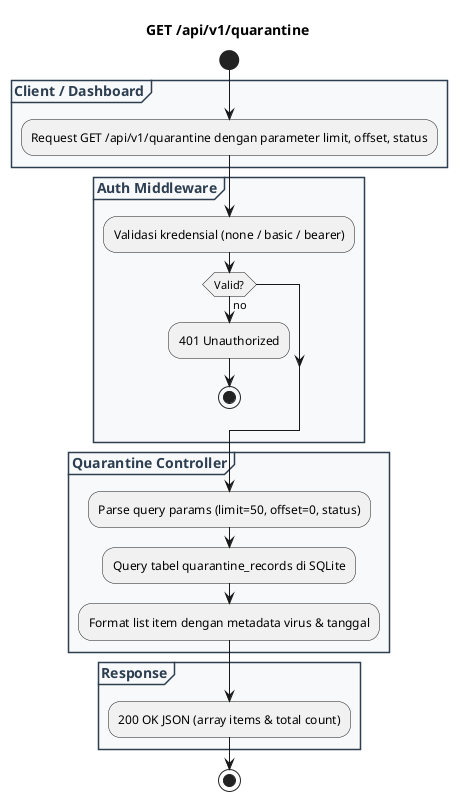

# REST API Spec — `GET /api/v1/quarantine`

## 1. Metadata

| Method | Endpoint | Description |
|---|---|---|
| `GET` | `/api/v1/quarantine` | Mengambil daftar riwayat file malware yang diisolasi di vault karantina dengan filter dan pagination. |

---

## 2. Diagram Swimlane



---

## 3. API Spec

### 3.1 Authentication
- Mengikuti `AUTH_MODE` (`none`, `basic`, `bearer`).

### 3.2 Query Parameter

| Key | Required | Type | Default | Description |
|---|---|---|---|---|
| `limit` | No | integer | `50` | Jumlah maksimal data yang dikembalikan |
| `offset` | No | integer | `0` | Offset pagination |
| `status` | No | string | `ALL` | Filter status file (`QUARANTINED`, `RESTORED`, `PURGED`) |

### 3.3 Path Parameter
- `Tidak ada`

### 3.4 Header Parameter

| Key | Required | Type | Default | Description |
|---|---|---|---|---|
| `Authorization` | Conditional | string | - | Sesuai `AUTH_MODE` |
| `X-API-Key` | Conditional | string | - | Alternatif bearer token |

### 3.5 Request Body
- `Tidak ada`

### 3.6 Response

**Code**: 200 OK  
**Meaning**: Daftar riwayat karantina berhasil diambil  
**JSON**:
```json
{
  "success": true,
  "total": 1,
  "items": [
    {
      "id": "Q-20260903-12ca0cb78c333bf4",
      "file_name": "eicar_test.txt",
      "file_size": 68,
      "file_sha256": "275a021bbfb6489e54d471899f7db9d1663fc695ec2fe2a2c4538aabf651fd0f",
      "virus_name": "Eicar-Test-Signature",
      "consumer_name": "Anonymous-Client",
      "status": "QUARANTINED",
      "quarantined_at": "2026-09-03T02:53:23Z",
      "expires_at": "2026-09-10T02:53:23Z"
    }
  ]
}
```

**Code**: 401 Unauthorized  
**Meaning**: Kredensial tidak valid  
**JSON**:
```json
{
  "success": false,
  "error": {
    "code": "UNAUTHORIZED",
    "message": "Invalid or missing basic authentication credentials",
    "details": null
  }
}
```

### 3.7 Notes
- File fisik di disk tersimpan terenkripsi/teracak di folder `/data/quarantine/{id}.quarantine`.

---

## 4. Rules

### 4.1 Authentication
- Mengikuti `AUTH_MODE`.

### 4.2 Validation
- `limit` maksimal 100 per request.

### 4.3 Error Handling
- Jika terjadi database lock atau error, mengembalikan `500 INTERNAL_SERVER_ERROR`.

### 4.4 Rate Limiting
- Kuota dibatasi oleh Rate Limiter umum.

### 4.5 Idempotency
- Operasi `GET` bersifat idempotent dan safe (read-only).

### 4.6 Security
- Hanya metadata yang ditampilkan, isi biner malware tidak pernah di-ekspos langsung via endpoint ini.

### 4.7 Non-Functional
- Waktu query < 15 ms memanfaatkan index pada kolom `quarantined_at` dan `status`.

### 4.8 Dependency
- SQLite DB (`quarantine_records`).

### 4.9 Versioning
- `/api/v1/quarantine`.

---

## 5. Asumsi, Risiko, dan Hal yang Perlu Dikonfirmasi

### Asumsi
- Retensi file karantina mengikuti `QUARANTINE_RETENTION_DAYS` (default 7 hari).

### Risiko Dokumentasi Tidak Lengkap
- File yang telah di-purge oleh worker berkala akan berstatus `PURGED` atau terhapus.

### Perlu Dikonfirmasi
- Penambahan filter berdasarkan nama virus di rilis berikutnya.
