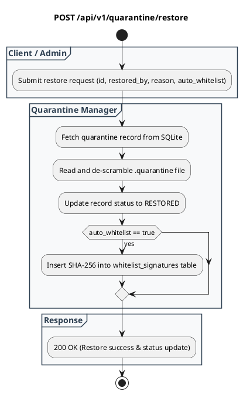

# REST API Spec — `POST /api/v1/quarantine/restore`

## 1. Metadata

| Method | Endpoint | Description |
|---|---|---|
| `POST` | `/api/v1/quarantine/restore` | Memulihkan (*restore*) file karantina ke sistem, men-descramble payload, dan mendaftarkan hash SHA-256 ke whitelist. |

---

## 2. Diagram Swimlane



---

## 3. API Spec

### 3.1 Authentication
- `Admin Access Required`: Bearer token admin atau internal SecOps credential.

### 3.2 Request Body

#### JSON
```json
{
  "quarantine_id": "Q-20260902-8f92a10b",
  "restored_by": "security-lead@company.com",
  "reason": "Verified false-positive internal payroll document",
  "auto_whitelist": true
}
```

#### Struktur Field

| Key | Required | Type | Description |
|---|---|---|---|
| `quarantine_id` | Yes | string | ID file di vault karantina |
| `restored_by` | Yes | string | Email atau identitas administrator yang menyetujui pemulihan |
| `reason` | Yes | string | Alasan audit pemulihan file |
| `auto_whitelist` | No | boolean | Otomatis mendaftarkan hash SHA-256 ke whitelist (default `true`) |

### 3.3 Response

**Code**: 200 OK  
**Meaning**: File berhasil dipulihkan & status diperbarui  
**JSON**:
```json
{
  "success": true,
  "message": "File restored successfully and hash whitelisted.",
  "data": {
    "quarantine_id": "Q-20260902-8f92a10b",
    "status": "RESTORED",
    "file_sha256": "e3b0c44298fc1c149afbf4c8996fb92427ae41e4649b934ca495991b7852b855",
    "whitelisted": true,
    "restored_at": "2026-09-02T19:35:00Z"
  }
}
```

---

## 4. Rules
- **Anti-Loop Prevention**: Saat `auto_whitelist=true`, hash SHA-256 didaftarkan ke tabel `whitelist_signatures` agar file tidak terkena karantina ulang saat dipindai kembali.
- **Audit Integrity**: Data `restored_by` dan `reason` wajib disimpan secara permanen di SQLite.
