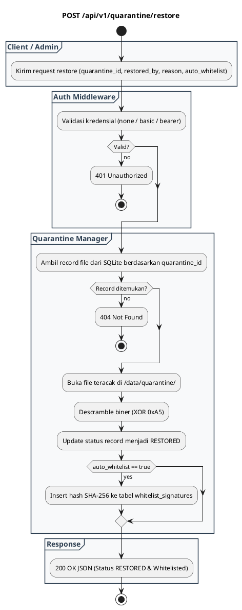

# REST API Spec — `POST /api/v1/quarantine/restore`

## 1. Metadata

| Method | Endpoint | Description |
|---|---|---|
| `POST` | `/api/v1/quarantine/restore` | Memulihkan (*restore*) file karantina ke sistem, men-descramble payload, dan mendaftarkan hash SHA-256 ke whitelist. |

---

## 2. Diagram Swimlane



---

## 3. API Spec

### 3.1 Authentication
- Mengikuti `AUTH_MODE`.

### 3.2 Query Parameter
- `Tidak ada`

### 3.3 Path Parameter
- `Tidak ada`

### 3.4 Header Parameter

| Key | Required | Type | Default | Description |
|---|---|---|---|---|
| `Content-Type` | Yes | string | `application/json` | Format payload JSON |
| `Authorization` | Conditional | string | - | Sesuai `AUTH_MODE` |
| `X-API-Key` | Conditional | string | - | Alternatif bearer token |

### 3.5 Request Body

#### JSON
```json
{
  "quarantine_id": "Q-20260903-12ca0cb78c333bf4",
  "restored_by": "secops-lead@company.internal",
  "reason": "False-positive internal business document",
  "auto_whitelist": true
}
```

#### Struktur Field

| Key | Required | Type | Description |
|---|---|---|---|
| `quarantine_id` | Yes | string | Identifier unik file di vault karantina |
| `restored_by` | Yes | string | Identitas petugas yang memulihkan |
| `reason` | Yes | string | Catatan alasan pemulihan untuk audit trail |
| `auto_whitelist` | No | boolean | Mendaftarkan SHA-256 ke database whitelist (default `true`) |

### 3.6 Response

**Code**: 200 OK  
**Meaning**: File berhasil dipulihkan dan hash dimasukkan ke whitelist  
**JSON**:
```json
{
  "success": true,
  "status": "RESTORED",
  "message": "File restored successfully and hash whitelisted.",
  "data": {
    "quarantine_id": "Q-20260903-12ca0cb78c333bf4",
    "status": "RESTORED",
    "file_sha256": "275a021bbfb6489e54d471899f7db9d1663fc695ec2fe2a2c4538aabf651fd0f",
    "whitelisted": true,
    "restored_at": "2026-09-03T02:55:00Z"
  }
}
```

**Code**: 400 Bad Request  
**Meaning**: Payload JSON malformed atau `quarantine_id` kosong  
**JSON**:
```json
{
  "success": false,
  "error": {
    "code": "INVALID_REQUEST_PAYLOAD",
    "message": "Missing quarantine_id parameter",
    "details": null
  }
}
```

**Code**: 401 Unauthorized  
**Meaning**: Kredensial tidak valid  
**JSON**:
```json
{
  "success": false,
  "error": {
    "code": "UNAUTHORIZED",
    "message": "Invalid credentials",
    "details": null
  }
}
```

**Code**: 404 Not Found  
**Meaning**: File ID karantina tidak ditemukan di database  
**JSON**:
```json
{
  "success": false,
  "error": {
    "code": "NOT_FOUND",
    "message": "Quarantine record not found",
    "details": null
  }
}
```

### 3.7 Notes
- Descrambler membalikkan masking XOR `0xA5` agar byte payload kembali ke bentuk aslinya.

---

## 4. Rules

### 4.1 Authentication
- Mengikuti `AUTH_MODE`.

### 4.2 Validation
- `quarantine_id` wajib diisi.

### 4.3 Error Handling
- Jika file fisik karantina sudah terhapus oleh retention cleaner, mengembalikan error `NOT_FOUND`.

### 4.4 Rate Limiting
- Dilindungi oleh kuota rate limit standar.

### 4.5 Idempotency
- Memanggil restore berulang kali untuk ID yang sama tetap berstatus `RESTORED` tanpa error duplikasi hash.

### 4.6 Security
- Penambahan hash ke tabel `whitelist_signatures` mencegah false-positive berulang pada scan berikutnya.

### 4.7 Non-Functional
- Transaksi ACID pada database SQLite memastikan integritas log audit pemulihan.

### 4.8 Dependency
- Vault Storage (`/data/quarantine/`) dan SQLite DB.

### 4.9 Versioning
- `/api/v1/quarantine/restore`.

---

## 5. Asumsi, Risiko, dan Hal yang Perlu Dikonfirmasi

### Asumsi
- User yang memiliki akses ke endpoint ini adalah operator yang berwenang.

### Risiko Dokumentasi Tidak Lengkap
- File yang di-whitelist tidak akan pernah di-scan lagi oleh daemon ClamAV (langsung lolos verdict `CLEAN`).

### Perlu Dikonfirmasi
- Mekanisme un-whitelist jika hash ternyata benar-benar berbahaya di kemudian hari.
