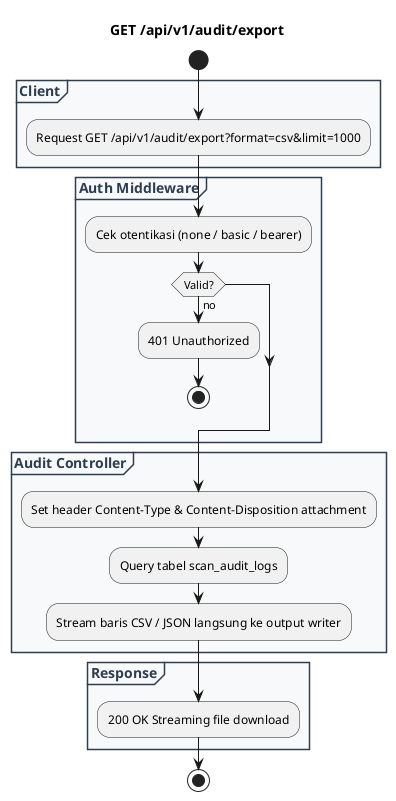

# REST API Spec — `GET /api/v1/audit/export`

## 1. Metadata

| Method | Endpoint | Description |
|---|---|---|
| `GET` | `/api/v1/audit/export` | Mengunduh data riwayat audit pemindaian dalam format CSV atau JSON streaming. |

---

## 2. Diagram Swimlane



---

## 3. API Spec

### 3.1 Authentication
- Mengikuti `AUTH_MODE`.

### 3.2 Query Parameter

| Key | Required | Type | Default | Description |
|---|---|---|---|---|
| `format` | No | string | `csv` | Format file yang diunduh (`csv` atau `json`) |
| `limit` | No | integer | `1000` | Jumlah maksimal baris yang di-export |
| `since` | No | string | - | Filter tanggal awal (format ISO 8601) |

### 3.3 Path Parameter
- `Tidak ada`

### 3.4 Header Parameter

| Key | Required | Type | Default | Description |
|---|---|---|---|---|
| `Authorization` | Conditional | string | - | Sesuai `AUTH_MODE` |

### 3.5 Request Body
- `Tidak ada`

### 3.6 Response

**Code**: 200 OK (Format CSV)  
**Content-Type**: `text/csv; charset=utf-8`  
**Header**: `Content-Disposition: attachment; filename="scan_audit_logs.csv"`  
**Body Preview**:
```csv
id,timestamp,consumer,file_name,verdict,virus_name,duration_ms
audit_1788350219521,2026-09-03T02:50:09Z,Anonymous-Client,README.md,CLEAN,,26
audit_1788350245112,2026-09-03T02:53:23Z,Anonymous-Client,eicar_test.txt,INFECTED,Eicar-Test-Signature,5
```

**Code**: 401 Unauthorized  
**Meaning**: Kredensial tidak valid  
**JSON**:
```json
{
  "success": false,
  "error": {
    "code": "UNAUTHORIZED",
    "message": "Invalid authentication credentials",
    "details": null
  }
}
```

### 3.7 Notes
- Format CSV langsung kompatibel dibuka di Microsoft Excel, Google Sheets, atau di-ingest ke SIEM (Splunk, Elastic, Datadog).

---

## 4. Rules

### 4.1 Authentication
- Mengikuti `AUTH_MODE`.

### 4.2 Validation
- `format` yang didukung: `csv`, `json`.

### 4.3 Error Handling
- Jika terjadi database lock, mengembalikan error `500`.

### 4.4 Rate Limiting
- Dibatasi untuk menghindari abuse query besar ke database SQLite.

### 4.5 Idempotency
- Operasi `GET` bersifat idempotent (read-only stream).

### 4.6 Security
- Data biner malware tidak disertakan dalam export, hanya hash SHA-256 dan metadata.

### 4.7 Non-Functional
- Menggunakan stream writer tanpa me-load seluruh record ke dalam RAM sekaligus.

### 4.8 Dependency
- SQLite database (`scan_audit_logs`).

### 4.9 Versioning
- `/api/v1/audit/export`.

---

## 5. Asumsi, Risiko, dan Hal yang Perlu Dikonfirmasi

### Asumsi
- Log lebih dari 3 hari sudah otomatis dibersihkan oleh `LOG_RETENTION_DAYS`.

### Risiko Dokumentasi Tidak Lengkap
- File export sangat besar jika volume transaksi ribuan per menit.

### Perlu Dikonfirmasi
- Penambahan filter berdasarkan nama consumer tertentu (`X-Consumer-Name`).
