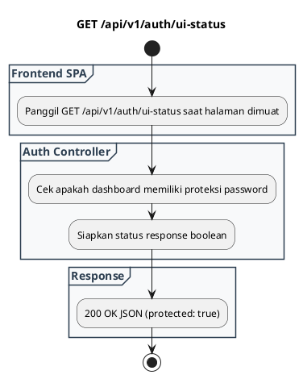

# REST API Spec — `GET /api/v1/auth/ui-status`

## 1. Metadata

| Method | Endpoint | Description |
|---|---|---|
| `GET` | `/api/v1/auth/ui-status` | Memeriksa status proteksi keamanan antarmuka Web Admin UI. |

---

## 2. Diagram Swimlane



---

## 3. API Spec

### 3.1 Authentication
- `Public Endpoint`: Selalu dapat diakses tanpa autentikasi (bypass).

### 3.2 Query Parameter
- `Tidak ada`

### 3.3 Path Parameter
- `Tidak ada`

### 3.4 Header Parameter
- `Tidak ada`

### 3.5 Request Body
- `Tidak ada`

### 3.6 Response

**Code**: 200 OK  
**Meaning**: Status proteksi berhasil dibaca  
**JSON**:
```json
{
  "success": true,
  "protected": true
}
```

### 3.7 Notes
- Endpoint ini digunakan oleh Single Page Application (`app.js`) untuk mengetahui apakah antarmuka memerlukan password unlock screen.

---

## 4. Rules

### 4.1 Authentication
- Public (Exempted from `AUTH_MODE`).

### 4.2 Validation
- `Tidak ada`

### 4.3 Error Handling
- Tidak melempar error di kondisi operasional normal.

### 4.4 Rate Limiting
- Ringan, tidak membebani database.

### 4.5 Idempotency
- Idempotent dan read-only.

### 4.6 Security
- Hanya mengembalikan status boolean (`true`/`false`), tidak mengekspos hash atau password.

### 4.7 Non-Functional
- Waktu respon < 2 ms.

### 4.8 Dependency
- Internal server state.

### 4.9 Versioning
- `/api/v1/auth/ui-status`.

---

## 5. Asumsi, Risiko, dan Hal yang Perlu Dikonfirmasi

### Asumsi
- Dashboard Web UI selalu diproteksi password (default `123456`).

### Risiko Dokumentasi Tidak Lengkap
- `Tidak ada`

### Perlu Dikonfirmasi
- Penambahan opsi menonaktifkan proteksi UI via env flag jika diinginkan user.
