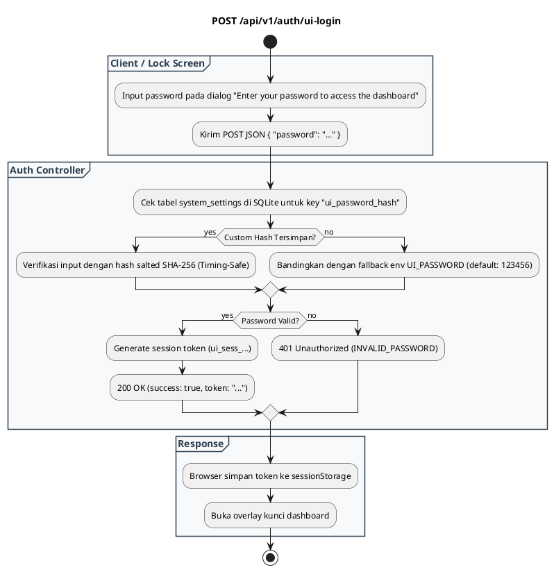

# REST API Spec — `POST /api/v1/auth/ui-login`

## 1. Metadata

| Method | Endpoint | Description |
|---|---|---|
| `POST` | `/api/v1/auth/ui-login` | Autentikasi sesi dashboard Web Admin UI menggunakan password (default `123456`). |

---

## 2. Diagram Swimlane



---

## 3. API Spec

### 3.1 Authentication
- `Public Endpoint`: Selalu dapat diakses tanpa autentikasi sebelumnya (bypass).

### 3.2 Query Parameter
- `Tidak ada`

### 3.3 Path Parameter
- `Tidak ada`

### 3.4 Header Parameter

| Key | Required | Type | Default | Description |
|---|---|---|---|---|
| `Content-Type` | Yes | string | `application/json` | Format payload JSON |

### 3.5 Request Body

#### JSON
```json
{
  "password": "my_secure_dashboard_password"
}
```

#### Struktur Field

| Key | Required | Type | Description |
|---|---|---|---|
| `password` | Yes | string | Kata sandi yang dimasukkan pengguna |

### 3.6 Response

**Code**: 200 OK  
**Meaning**: Autentikasi berhasil  
**JSON**:
```json
{
  "success": true,
  "token": "ui_sess_1788350219521000",
  "message": "Authenticated successfully"
}
```

**Code**: 400 Bad Request  
**Meaning**: Format JSON rusak atau kosong  
**JSON**:
```json
{
  "success": false,
  "error": {
    "code": "INVALID_REQUEST_PAYLOAD",
    "message": "Malformed JSON payload",
    "details": null
  }
}
```

**Code**: 401 Unauthorized  
**Meaning**: Kata sandi salah  
**JSON**:
```json
{
  "success": false,
  "error": {
    "code": "INVALID_PASSWORD",
    "message": "Incorrect dashboard password",
    "details": null
  }
}
```

### 3.7 Notes
- Token sesi disimpan di `sessionStorage` browser dan otomatis hilang saat tab browser ditutup.

---

## 4. Rules

### 4.1 Authentication
- Public route untuk memfasilitasi login awal.

### 4.2 Validation
- Field `password` wajib diisi string non-kosong.

### 4.3 Error Handling
- Password salah mengembalikan `401 INVALID_PASSWORD`.

### 4.4 Rate Limiting
- Dilindungi oleh Rate Limiter agar tahan terhadap serangan brute-force.

### 4.5 Idempotency
- Memasukkan password yang benar berulang kali tetap mengembalikan token sesi baru yang valid.

### 4.6 Security
- Verifikasi password menggunakan `subtle.ConstantTimeCompare` untuk mencegah serangan timing analysis.
- Penyimpanan password menggunakan salt 16-byte acak + SHA-256.

### 4.7 Non-Functional
- Waktu verifikasi < 10 ms.

### 4.8 Dependency
- SQLite DB (`system_settings`) dan modul `internal/crypto`.

### 4.9 Versioning
- `/api/v1/auth/ui-login`.

---

## 5. Asumsi, Risiko, dan Hal yang Perlu Dikonfirmasi

### Asumsi
- Password bawaan awal saat first boot adalah `123456`.

### Risiko Dokumentasi Tidak Lengkap
- `Tidak ada`

### Perlu Dikonfirmasi
- Penambahan opsi Multi-Factor Authentication (MFA/TOTP) untuk rilis enterprise di masa depan.
