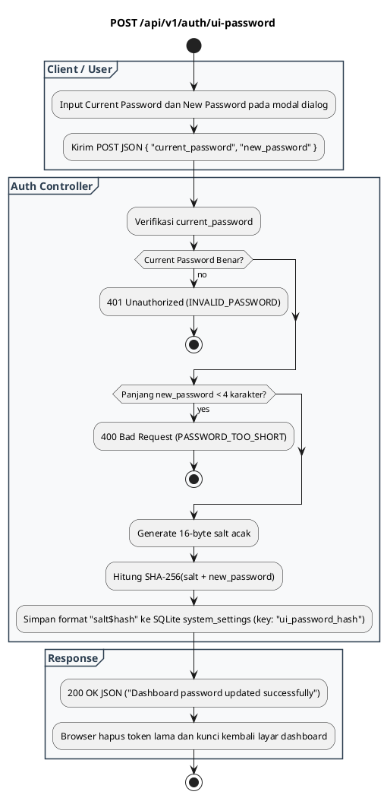

# REST API Spec — `POST /api/v1/auth/ui-password`

## 1. Metadata

| Method | Endpoint | Description |
|---|---|---|
| `POST` | `/api/v1/auth/ui-password` | Mengubah kata sandi dashboard Web Admin UI dan menyimpannya secara persisten ke database SQLite. |

---

## 2. Diagram Swimlane



---

## 3. API Spec

### 3.1 Authentication
- Endpoint ini memverifikasi kata sandi saat ini (`current_password`) secara langsung di payload request.

### 3.2 Query Parameter
- `Tidak ada`

### 3.3 Path Parameter
- `Tidak ada`

### 3.4 Header Parameter

| Key | Required | Type | Default | Description |
|---|---|---|---|---|
| `Content-Type` | Yes | string | `application/json` | Format payload JSON |

### 3.5 Request Body

#### JSON
```json
{
  "current_password": "old_password_123",
  "new_password": "my_new_super_secret_password"
}
```

#### Struktur Field

| Key | Required | Type | Description |
|---|---|---|---|
| `current_password` | Yes | string | Kata sandi saat ini yang sedang aktif |
| `new_password` | Yes | string | Kata sandi baru (minimal 4 karakter) |

### 3.6 Response

**Code**: 200 OK  
**Meaning**: Kata sandi berhasil diperbarui dan disimpan permanen  
**JSON**:
```json
{
  "success": true,
  "message": "Dashboard password updated successfully"
}
```

**Code**: 400 Bad Request  
**Meaning**: Kata sandi baru terlalu pendek (< 4 karakter) atau payload rusak  
**JSON**:
```json
{
  "success": false,
  "error": {
    "code": "PASSWORD_TOO_SHORT",
    "message": "New password must be at least 4 characters long",
    "details": null
  }
}
```

**Code**: 401 Unauthorized  
**Meaning**: Kata sandi saat ini (`current_password`) salah  
**JSON**:
```json
{
  "success": false,
  "error": {
    "code": "INVALID_PASSWORD",
    "message": "Current password does not match",
    "details": null
  }
}
```

### 3.7 Notes
- Setelah berhasil, sesi aktif dihapus dan pengguna diminta login ulang menggunakan password baru.

---

## 4. Rules

### 4.1 Authentication
- Memerlukan validasi password lama di body payload.

### 4.2 Validation
- Panjang `new_password` minimal 4 karakter.

### 4.3 Error Handling
- Jika database error saat update SQLite, mengembalikan `500 INTERNAL_SERVER_ERROR`.

### 4.4 Rate Limiting
- Kuota rate limit standar.

### 4.5 Idempotency
- Mengubah password ke nilai baru yang sama diperbolehkan (men-generate salt baru).

### 4.6 Security
- Salt acak 16-byte di-generate per transaksi menggunakan `crypto/rand`.
- String disimpan dalam format `salt$hash` di tabel `system_settings`.

### 4.7 Non-Functional
- Perubahan berlaku instan secara real-time tanpa memerlukan restart container.

### 4.8 Dependency
- SQLite database (`system_settings`) dan modul `crypto`.

### 4.9 Versioning
- `/api/v1/auth/ui-password`.

---

## 5. Asumsi, Risiko, dan Hal yang Perlu Dikonfirmasi

### Asumsi
- Password baru yang telah diubah akan bertahan permanen di database volume `./data`.

### Risiko Dokumentasi Tidak Lengkap
- `Tidak ada`

### Perlu Dikonfirmasi
- Penambahan history password agar tidak bisa memakai password yang sama berulang kali.
