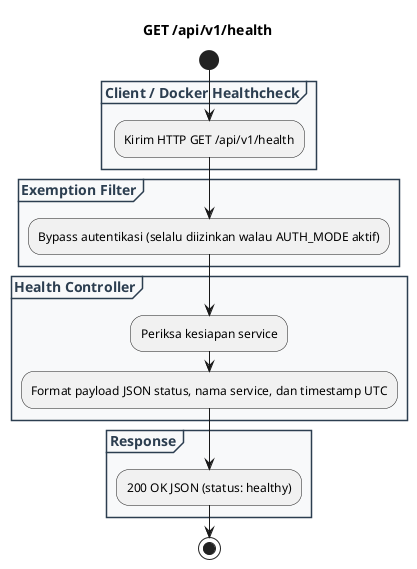

# REST API Spec — `GET /api/v1/health`

## 1. Metadata

| Method | Endpoint | Description |
|---|---|---|
| `GET` | `/api/v1/health` | Healthcheck & readiness probe untuk memantau status operasional service, uptime, dan ketersediaan daemon ClamAV. |

---

## 2. Diagram Swimlane



---

## 3. API Spec

### 3.1 Authentication
- `Public / Exempt`: Selalu di-bypass agar container healthcheck dan load balancer tidak terblokir.

### 3.2 Query Parameter
- `Tidak ada`

### 3.3 Path Parameter
- `Tidak ada`

### 3.4 Header Parameter
- `Tidak ada`

### 3.5 Request Body
- `Tidak ada`

### 3.6 Response

**Code**: 200 OK  
**Meaning**: Service berjalan normal dan siap melayani request pemindaian  
**JSON**:
```json
{
  "service": "clamav-service",
  "status": "healthy",
  "timestamp": "2026-09-03T02:53:20Z"
}
```

### 3.7 Notes
- Digunakan oleh Docker Compose `healthcheck`:
  `test: ["CMD", "curl", "-f", "http://localhost:8080/api/v1/health"]`

---

## 4. Rules

### 4.1 Authentication
- Selalu public (no auth).

### 4.2 Validation
- `Tidak ada`

### 4.3 Error Handling
- Jika service mati, container engine mendeteksi kegagalan koneksi TCP/HTTP.

### 4.4 Rate Limiting
- Di-exempt dari pembatasan rate limit agar probe monitoring tidak tercekik (*throttled*).

### 4.5 Idempotency
- Idempotent dan safe.

### 4.6 Security
- Tidak mengekspos informasi rahasia atau kredensial internal.

### 4.7 Non-Functional
- Waktu respon ultra-cepat (< 1 ms).

### 4.8 Dependency
- Core HTTP server.

### 4.9 Versioning
- `/api/v1/health`.

---

## 5. Asumsi, Risiko, dan Hal yang Perlu Dikonfirmasi

### Asumsi
- Endpoint ini dipanggil setiap 15 detik oleh Docker healthcheck.

### Risiko Dokumentasi Tidak Lengkap
- `Tidak ada`

### Perlu Dikonfirmasi
- Penambahan detail status koneksi socket ClamAV jika ingin deep-healthcheck di masa depan.
