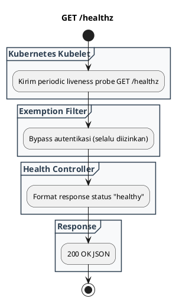

# REST API Spec — `GET /healthz`

## 1. Metadata

| Method | Endpoint | Description |
|---|---|---|
| `GET` | `/healthz` | Kubernetes lightweight liveness & readiness probe endpoint. |

---

## 2. Diagram Swimlane



---

## 3. API Spec

### 3.1 Authentication
- `Public / Exempt`: Bebas autentikasi.

### 3.2 Query Parameter
- `Tidak ada`

### 3.3 Path Parameter
- `Tidak ada`

### 3.4 Header Parameter
- `Tidak ada`

### 3.5 Request Body
- `Tidak ada`

### 3.6 Response

**Code**: 200 OK  
**JSON**:
```json
{
  "service": "clamav-service",
  "status": "healthy",
  "timestamp": "2026-09-03T02:53:20Z"
}
```

### 3.7 Notes
- Standar konvensi penamaan liveness probe di ekosistem Kubernetes.

---

## 4. Rules

### 4.1 Authentication
- Public (Exempted).

### 4.2 Validation
- `Tidak ada`

### 4.3 Error Handling
- `Tidak ada`

### 4.4 Rate Limiting
- Exempted.

### 4.5 Idempotency
- Idempotent.

### 4.6 Security
- Aman.

### 4.7 Non-Functional
- < 1 ms.

### 4.8 Dependency
- None.

### 4.9 Versioning
- `/healthz`.

---

## 5. Asumsi, Risiko, dan Hal yang Perlu Dikonfirmasi

### Asumsi
- Mengikuti standar konvensi K8s.
