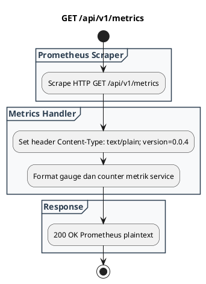

# REST API Spec — `GET /api/v1/metrics`

## 1. Metadata

| Method | Endpoint | Description |
|---|---|---|
| `GET` | `/api/v1/metrics` | Endpoint Prometheus telemetry metrics dalam format standar (`text/plain; version=0.0.4`). |

---

## 2. Diagram Swimlane



---

## 3. API Spec

### 3.1 Authentication
- Mengikuti `AUTH_MODE`.

### 3.2 Query Parameter
- `Tidak ada`

### 3.3 Path Parameter
- `Tidak ada`

### 3.4 Header Parameter

| Key | Required | Type | Default | Description |
|---|---|---|---|---|
| `Authorization` | Conditional | string | - | Sesuai `AUTH_MODE` jika scraper diautentikasi |

### 3.5 Request Body
- `Tidak ada`

### 3.6 Response

**Code**: 200 OK  
**Content-Type**: `text/plain; version=0.0.4; charset=utf-8`  
**Body**:
```text
# HELP clamav_service_up Status of clamav service
# TYPE clamav_service_up gauge
clamav_service_up 1
```

### 3.7 Notes
- Langsung kompatibel dengan Prometheus Server, Grafana Agent, VictoriaMetrics, dan OpenTelemetry Collector.

---

## 4. Rules

### 4.1 Authentication
- Mengikuti `AUTH_MODE`.

### 4.2 Validation
- `Tidak ada`

### 4.3 Error Handling
- Selalu merespons plaintext.

### 4.4 Rate Limiting
- Kuota standar.

### 4.5 Idempotency
- Idempotent dan safe.

### 4.6 Security
- Tidak mengekspos payload atau path lokal sensitif.

### 4.7 Non-Functional
- Sangat ringan (< 2 ms).

### 4.8 Dependency
- Internal metrics gauge.

### 4.9 Versioning
- `/api/v1/metrics`.

---

## 5. Asumsi, Risiko, dan Hal yang Perlu Dikonfirmasi

### Asumsi
- Scraper internal dapat mengakses metrics jika diatur tanpa auth atau dengan bearer scraper token.
