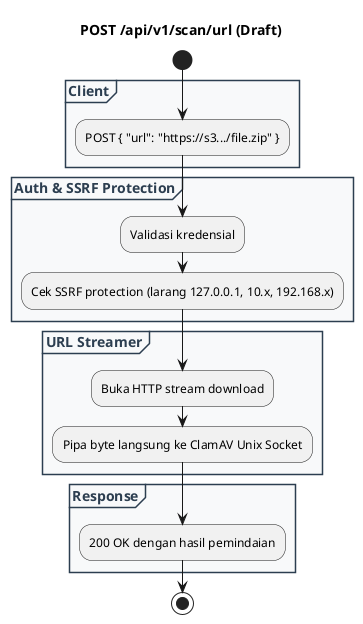

# REST API Spec — `POST /api/v1/scan/url`

## 1. Metadata

| Method | Endpoint | Description | Status |
|---|---|---|---|
| `POST` | `/api/v1/scan/url` | Pemindaian file remote melalui unduhan stream URL publik / AWS S3 presigned URL. | `Draft (Roadmap 1.1)` |

---

## 2. Diagram Swimlane



---

## 3. API Spec

### 3.1 Authentication
- Mengikuti `AUTH_MODE`.

### 3.2 Request Body
```json
{
  "url": "https://storage.example.com/uploads/invoice.pdf",
  "expected_sha256": "optional_hash"
}
```

### 3.3 Response
```json
{
  "success": true,
  "verdict": "CLEAN",
  "data": {
    "source_url": "https://storage.example.com/uploads/invoice.pdf",
    "file_size": 1048576,
    "file_sha256": "85fd0bd05139936de5a2fb89ce9269ddc3980dcf64c7bc6064e1c6567d15c61a",
    "scan_duration_ms": 120
  }
}
```

---

## 4. Rules & Status
- **Status**: `Draft / Planned`. Telah terdaftar di blueprint arsitektur roadmap 1.1.
- **SSRF Hardening**: Wajib memblokir private IP range (RFC 1918) dan cloud metadata IP (`169.254.169.254`).
