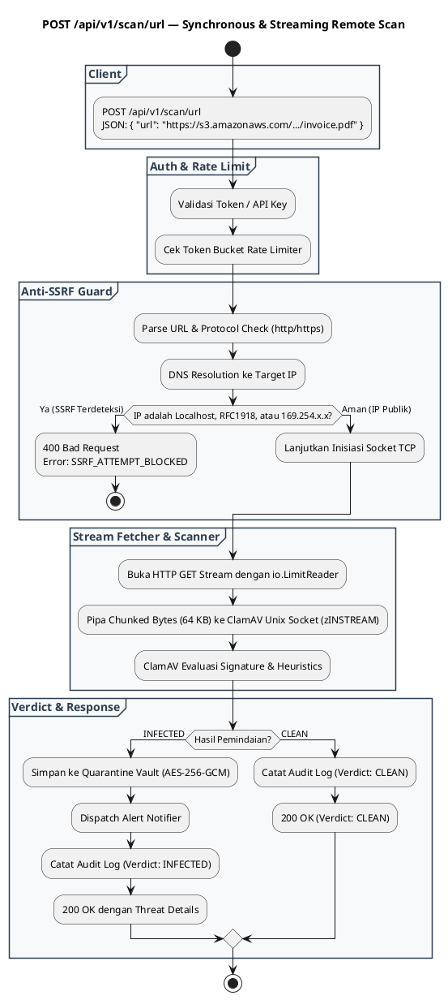

# REST API Spec — `POST /api/v1/scan/url`

## 1. Metadata

| Method | Endpoint | Description | Status |
|---|---|---|---|
| `POST` | `/api/v1/scan/url` | Pemindaian file remote melalui streaming download aman (Anti-SSRF Protected). Mendukung URL publik & S3 Presigned URL. | `Published` |

---

## 2. Diagram Swimlane



---

## 3. Spesifikasi Kontrak API

### 3.1. Headers
| Header | Tipe | Wajib | Keterangan |
|---|---|---|---|
| `Content-Type` | `string` | Ya | Wajib `application/json` |
| `Authorization` | `string` | Kondisional | Wajib jika `AUTH_MODE=bearer` (`Bearer <token>`) atau `AUTH_MODE=basic` |
| `X-Consumer-Name` | `string` | Tidak | Nama identitas aplikasi pemanggil (default: `anonymous-api`) |

### 3.2. Request Body
```json
{
  "url": "https://s3.amazonaws.com/my-corp-bucket/documents/annual_report.pdf",
  "expected_sha256": "e3b0c44298fc1c149afbf4c8996fb92427ae41e4649b934ca495991b7852b855"
}
```

#### Aturan Validasi Field:
1. `url` (*string, wajib*): URL HTTP/HTTPS yang valid dan dapat diakses. Panjang maksimal 2048 karakter.
2. `expected_sha256` (*string, opsional*): Checksum 64 karakter hex untuk memvalidasi integritas file pasca-unduh.

---

## 4. Respons API

### 4.1. Respons 200 OK (File Bersih / CLEAN)
```json
{
  "success": true,
  "verdict": "CLEAN",
  "data": {
    "source_url": "https://s3.amazonaws.com/my-corp-bucket/documents/annual_report.pdf",
    "file_size": 2489100,
    "file_sha256": "e3b0c44298fc1c149afbf4c8996fb92427ae41e4649b934ca495991b7852b855",
    "scan_duration_ms": 142,
    "scanned_at": "2026-09-04T16:25:00Z"
  }
}
```

### 4.2. Respons 200 OK (File Terinfeksi / INFECTED)
```json
{
  "success": true,
  "verdict": "INFECTED",
  "threat": {
    "virus_name": "Win.Trojan.Generic-10294",
    "severity": "HIGH",
    "action_taken": "QUARANTINED",
    "quarantine_id": "Q-20260904-8f2c7a10"
  },
  "data": {
    "source_url": "https://s3.amazonaws.com/my-corp-bucket/documents/invoice.exe",
    "file_size": 892014,
    "file_sha256": "a3b2c1...",
    "scan_duration_ms": 185
  }
}
```

### 4.3. Respons 400 Bad Request (SSRF Terdeteksi & Diblokir)
```json
{
  "success": false,
  "error": {
    "code": "SSRF_ATTEMPT_BLOCKED",
    "message": "The provided target URL resolves to a prohibited private, loopback, or cloud-metadata IP address",
    "details": {
      "target_host": "169.254.169.254",
      "policy": "RFC1918, Loopback, and Link-Local IPs are strictly forbidden"
    }
  }
}
```

### 4.4. Respons 413 Payload Too Large
```json
{
  "success": false,
  "error": {
    "code": "FILE_TOO_LARGE",
    "message": "Remote file exceeds the configured maximum scanning size limit (100 MB)",
    "details": null
  }
}
```

### 4.5. Respons 504 Gateway Timeout (Download Lambat / Gagal)
```json
{
  "success": false,
  "error": {
    "code": "DOWNLOAD_TIMEOUT",
    "message": "Failed to stream remote file within the allowed 30-second window",
    "details": null
  }
}
```

---

## 5. Matriks Aturan Keamanan Anti-SSRF

| Target Resolusi IP | Klasifikasi Jaringan | Tindakan |
|---|---|---|
| `127.0.0.1`, `127.0.0.0/8`, `::1` | Localhost / Loopback | ❌ **BLOCKED** (`SSRF_ATTEMPT_BLOCKED`) |
| `169.254.169.254`, `169.254.0.0/16` | AWS/GCP/Azure Metadata & Link-Local | ❌ **BLOCKED** (`SSRF_ATTEMPT_BLOCKED`) |
| `10.0.0.0/8`, `172.16.0.0/12`, `192.168.0.0/16` | Intranet Privat (RFC1918) | ❌ **BLOCKED** (`SSRF_ATTEMPT_BLOCKED`) |
| `100.64.0.0/10` | Carrier-Grade NAT | ❌ **BLOCKED** (`SSRF_ATTEMPT_BLOCKED`) |
| `0.0.0.0`, `::` | Wildcard Bind Address | ❌ **BLOCKED** (`SSRF_ATTEMPT_BLOCKED`) |
| Public IP (misal: `52.216.x.x`, `151.101.x.x`) | Internet Public IP | ✅ **ALLOWED** |

---
*Generated by AI Documentor — REST API Specification Suite*
