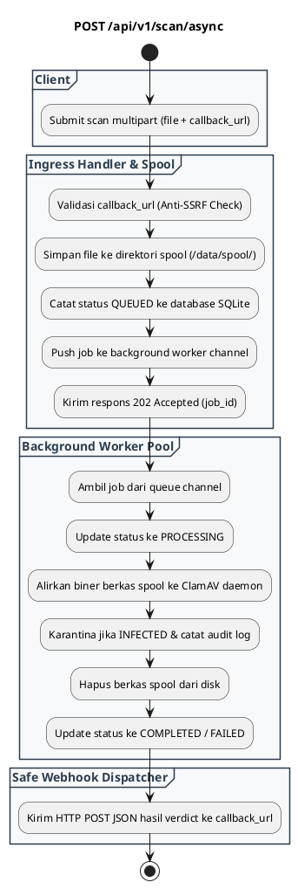

# REST API Spec — `POST /api/v1/scan/async`

## 1. Metadata

| Method | Endpoint | Description | Status |
|---|---|---|---|
| `POST` | `/api/v1/scan/async` | Pengajuan job pemindaian asinkron dengan webhook callback (`202 Accepted`). | `Published` (Active / Production Ready) |

---

## 2. Diagram Swimlane



---

## 3. API Spec

### 3.1 Authentication
- Mengikuti `AUTH_MODE` (`none`, `basic`, `bearer`).

### 3.2 Request Contract (Multipart/form-data)
* `file`: Berkas biner yang akan dipindai (Wajib).
* `callback_url`: URL tujuan pengiriman webhook hasil pemindaian (Wajib, skema `http://` atau `https://`).

### 3.3 Response (202 Accepted)
```json
{
  "success": true,
  "status": "ACCEPTED",
  "job_id": "job_1788350219",
  "message": "Scan job queued. Verdict will be posted to callback_url.",
  "data": {
    "job_id": "job_1788350219",
    "file_name": "large_archive.zip",
    "file_size": 104857600,
    "callback_url": "https://consumer.corp.internal/webhooks/antivirus",
    "status": "QUEUED"
  }
}
```

### 3.4 Webhook Callback Payload (Dikirim via HTTP POST ke callback_url)
```json
{
  "event": "scan.completed",
  "job_id": "job_1788350219",
  "status": "COMPLETED",
  "verdict": "CLEAN",
  "data": {
    "file_name": "large_archive.zip",
    "file_size": 104857600,
    "file_sha256": "9f86d081884c7d659a2feaa0c55ad015a3bf4f1b2b0b822cd15d6c15b0f00a08",
    "scan_duration_ms": 312,
    "completed_at": "2026-09-07T16:02:00Z"
  }
}
```
Jika `INFECTED`:
```json
{
  "event": "scan.completed",
  "job_id": "job_1788350219",
  "status": "COMPLETED",
  "verdict": "INFECTED",
  "threat": {
    "virus_name": "Win.Trojan.Generic-99",
    "action_taken": "QUARANTINED",
    "quarantine_id": "Q-20260907-01J7K..."
  },
  "data": {
    "file_name": "malware.exe",
    "file_size": 204800,
    "file_sha256": "5e884898da28047151d0e56f8dc6292773603d0d6aabbdd62a11ef721d1542d8",
    "scan_duration_ms": 84,
    "completed_at": "2026-09-07T16:02:00Z"
  }
}
```
