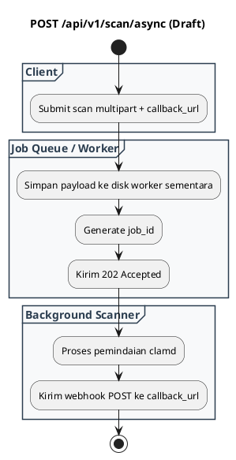

# REST API Spec — `POST /api/v1/scan/async`

## 1. Metadata

| Method | Endpoint | Description | Status |
|---|---|---|---|
| `POST` | `/api/v1/scan/async` | Pengajuan job pemindaian asinkron dengan webhook callback (`202 Accepted`). | `Draft (Roadmap 1.1)` |

---

## 2. Diagram Swimlane



---

## 3. API Spec

### 3.1 Authentication
- Mengikuti `AUTH_MODE`.

### 3.2 Request Body
- `file` (Multipart file)
- `callback_url` (String URL tujuan webhook hasil scan)

### 3.3 Response (202 Accepted)
```json
{
  "success": true,
  "status": "ACCEPTED",
  "job_id": "job_1788350219",
  "message": "Scan job queued. Verdict will be posted to callback_url."
}
```

---

## 4. Rules & Status
- **Status**: `Draft / Planned`. Ditujukan untuk file berukuran besar (> 50 MB) agar tidak menahan socket HTTP.
